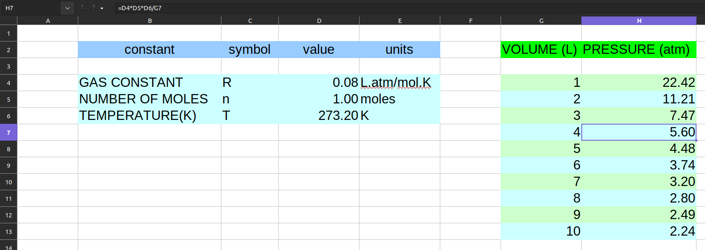

# Example

This is a demo program that uses `clerk` to produce an `xlsx` file that looks as follows:



Alternatively, with formulas enabled:


This file has a sheet with several tables. These are tables for
constants' header, volume & pressure header, volume & pressure values, and a table per a constant's value.
Let's see how we can construct such a sheet.

## Imports

First, we import the necessary stuff.

```haskell
module Example where
import Clerk
import Codec.Xlsx qualified as X
import Codec.Xlsx.Formatted qualified as X
import Control.Lens ((%~), (&), (?~))
import Data.ByteString.Lazy qualified as L
import Data.Text qualified as T
import Data.Time.Clock.POSIX (getPOSIXTime)
import Control.Monad (void)
```

## Inputs

Following that, we declare a number of data types that we'll use to store the input values.

A type for constants' headers.

```haskell
data ConstantsHeader = ConstantsHeader
    { hConstant :: String
    , hSymbol :: String
    , hValue :: String
    , hUnits :: String
    }

constantsHeader :: ConstantsHeader
constantsHeader =
    ConstantsHeader
        { hConstant = "constant"
        , hSymbol = "symbol"
        , hValue = "value"
        , hUnits = "units"
        }
```

A type for constants' data.

```haskell
data ConstantsData a = ConstantsData
    { name :: String
    , symbol :: String
    , value :: a
    , units :: String
    }
```

Additionally, we declare a helper type that will store all constants together.

```haskell
data ConstantsInput = ConstantsInput
    { gas :: ConstantsData Double
    , nMoles :: ConstantsData Double
    , temperature :: ConstantsData Double
    }

constants :: ConstantsInput
constants =
    ConstantsInput
        { gas = ConstantsData "GAS CONSTANT" "R" 0.08206 "L.atm/mol.K"
        , nMoles = ConstantsData "NUMBER OF MOLES" "n" 1 "moles"
        , temperature = ConstantsData "TEMPERATURE(K)" "T" 273.2 "K"
        }
```

A type for the Volume & Pressure header.

```haskell
data ValuesHeader = ValuesHeader
    { hVolume :: String
    , hPressure :: String
    }

valuesHeader :: ValuesHeader
valuesHeader =
    ValuesHeader
        { hVolume = "VOLUME (L)"
        , hPressure = "PRESSURE (atm)"
        }
```

The last type is for volume inputs. We just generate them

```haskell
newtype Volume = Volume
    { volume :: Double
    }

volumeData :: [Volume]
volumeData = take 10 $ Volume <$> [1 ..]
```

## Styles

Following the headers and data types, we define the styles. Let's start with colors.
We select several color codes and store them into `colors`

```haskell
data Colors = Colors
    { lightBlue :: T.Text
    , lightGreen :: T.Text
    , blue :: T.Text
    , green :: T.Text
    }

colors :: Colors
colors =
    Colors
        { lightGreen = "90CCFFCC"
        , lightBlue = "90CCFFFF"
        , blue = "FF99CCFF"
        , green = "FF00FF00"
        }
```

Next, we convert them to `FormatCell` function

```haskell
colorBlue :: FormatCell
colorBlue = mkColorStyle colors.blue

colorLightBlue :: FormatCell
colorLightBlue = mkColorStyle colors.lightBlue

colorGreen :: FormatCell
colorGreen = mkColorStyle colors.green

colorMixed :: FormatCell
colorMixed coords idx = mkColorStyle (if even idx then colors.lightGreen else colors.lightBlue) coords idx
```

Additionally, we compose a transform for the number format

```haskell
-- | allow 2 decimal digits
nf2decimal :: FCTransform
nf2decimal fc = fc & X.formattedFormat %~ (\ff -> ff & X.formatNumberFormat ?~ X.StdNumberFormat X.Nf2Decimal)
```

And a transform for centering the cell contents

```haskell
alignCenter :: FCTransform
alignCenter = horizontalAlignment X.CellHorizontalAlignmentCenter
```

## `Builder`s

Now, we are able to compose the `Builder`s for tables.

A builder for the constants header.

```haskell
constantsHeaderBuilder :: Builder ConstantsHeader CellData (Coords, Coords)
constantsHeaderBuilder = do
    tl <- columnWidth 20 (alignCenter <| colorBlue) hConstant
    columnWidth_ 8 (alignCenter <| colorBlue) hSymbol
    column_ (alignCenter <| colorBlue) hValue
    tr <- column (alignCenter <| colorBlue) hUnits
    return (unCell tl, unCell tr)
```

A builder for a constant. We'll use this builder for each constant separately
as each constant produces cells of a specific type.

```haskell
constantBuilder :: forall a. ToCellData a => Builder (ConstantsData a) CellData (Coords, Cell a)
constantBuilder = do
    topLeft <- column colorLightBlue name
    column_ colorLightBlue symbol
    value <- column (nf2decimal <| colorLightBlue) value
    column_ colorLightBlue units
    return (unCell topLeft, value)
```

A builder for values' header

```haskell
valuesHeaderBuilder :: Builder ValuesHeader CellData Coords
valuesHeaderBuilder = do
    tl <- column colorGreen hVolume
    columnWidth_ 16 colorGreen hPressure
    return (unCell tl)

data ConstantsValues = ConstantsValues
    { gas :: Cell Double
    , nMoles :: Cell Double
    , temperature :: Cell Double
    }
```

A builder for volume & pressure

```haskell
valuesBuilder :: ConstantsValues -> Builder Volume CellData ()
valuesBuilder cv = do
    volume' <- column colorMixed volume
    let pressure' = ex cv.gas |*| ex cv.nMoles |*| ex cv.temperature |/| ex volume'
    column_ (nf2decimal <| colorMixed) (const pressure')
```


## `SheetBuilder`

The `SheetBuilder` is used to place builders onto a sheet and glue them together

```haskell
full :: SheetBuilder ()
full = do
    (constantsHeaderTL, constantsHeaderTR) <- placeInput (Coords 2 2) constantsHeader constantsHeaderBuilder
    (gasTL, gas) <- placeInput (overRow (+ 2) constantsHeaderTL) constants.gas constantBuilder
    (nMolesTL, nMoles) <- placeInput (overRow (+ 1) gasTL) constants.nMoles constantBuilder
    temperature <- snd <$> placeInput (overRow (+ 1) nMolesTL) constants.temperature constantBuilder
    valuesHeaderTL <- placeInput (overCol (+ 2) constantsHeaderTR) valuesHeader valuesHeaderBuilder
    placeInputs_ (overRow (+ 2) valuesHeaderTL) volumeData (valuesBuilder $ ConstantsValues{..})
```

## Result

Now, we can write the result and get the images that you've seen at the top of this tutorial.

```haskell
writeWorksheet :: SheetBuilder a -> String -> IO ()
writeWorksheet tb name = do
    ct <- getPOSIXTime
    let
        xlsx = composeXlsx [("List 1", void tb)]
    L.writeFile ("example-" <> name <> ".xlsx") $ X.fromXlsx ct xlsx

writeEx :: IO ()
writeEx = writeWorksheet full "1"

main :: IO ()
main = writeEx
```

With formulas enabled:


